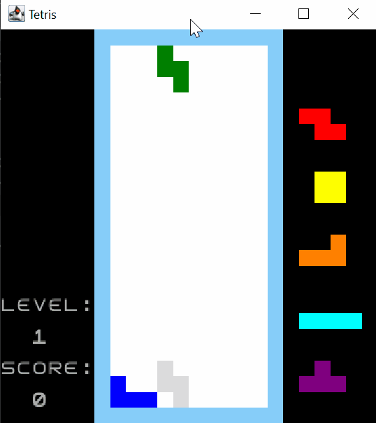
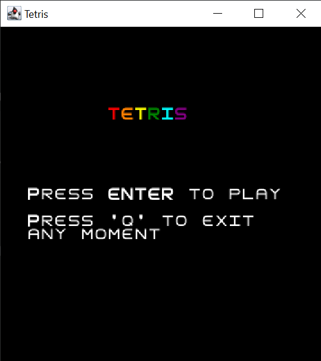
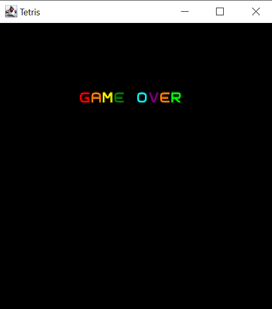

## LDTS_1204 - TETRIS

### GAME DESCRIPTION

Tetris is a tile-matching puzzle game where the player attempt to clear as many lines as possible by completing horizontal rows of blocks without empty space, but if the blocks surpass the skyline the game is over! 

To do this, the game requires players to strategically rotate, move, and drop several blocks of different shapes that fall into the rectangular arena at increasing speeds. 

The completed lines disappear and grant the player points.

There are levels of difficulties which rises as the game is being played.

It ends when the playing field is filled. The longer the player can delay this outcome, the higher the score will be.

This project was developed by Bruna Marques (up202007191@edu.fe.up.pt), Ana Carolina Brandão (up202004461@edu.fc.up.pt) and Miguel Curval (up201105191@edu.fe.up.pt).

### IMPLEMENTED FEATURES

+ **Menu** - When the game starts, the screen shows the starting menu. The player has to press <kbd>Enter</kbd> to star the game and can press <kbd>Q</kbd> anytime to end it.
+ **Player control** - The player may move the pieces with the keyboard control:
  - Move right: <kbd>&rarr;</kbd>
  - Move left: <kbd>&larr;</kbd>
  - Rotate clockwise: <kbd>&uarr;</kbd>
  - Rotate counterclockwise: <kbd>x</kbd>
  - Soft Drop: <kbd>&darr;</kbd>
  - Hard Drop: <kbd>Spacebar</kbd>
  - Hold: <kbd>c</kbd>
+ **Levels** - The game increases difficulty/speed in each level.
+ **Speed** - The speed of the piece changes when it passes the level or when the player presses any of the (hard or soft) drop keys.
+ **Shapes and colors** - Blocks have different shapes and colors.
+ **Next blocks** - Preview of the next five blocks.
+ **Hold** - Ability to put the current block on hold to use it later.
+ **Time** - Time of the game to measure when it passes the level.
+ **Score** - The score the player makes on the screen. Points are made when completing a game line with pieces
+ **GameOver** - When the player loses, it appears a screen with GAMEOVER written.
+ **Ghost piece** - During the game, before the piece falls, a preview (ghost piece) is shown of how the piece will fit depending on how it is positioned when it falls. 
+ **Music** - When the game starts, when the player press <kbd>Enter</kbd>, tetris theme song plays until it's gameover.
+ **Tetris Guidelines** - The game has every single rule from the official Tetris Guidelines implemented.

### PLANNED FEATURES

+ **Menus** - There is always a button to access different menus during the game. (Ex: Main Menu, Instructions, Play and Pause).
+ **Player control** - The player may move the pieces with the keyboard.
+ **Levels** - The game increases difficulty/speed in each level.
+ **Shapes and colors** - Blocks have different shapes and colors.
+ **Background** - When the background color flashes, it means that the level has increased.
+ **Next blocks** - Preview of the next three blocks.
+ **Hold** - Ability to put the current block on hold to use it later.
+ **Time** - Time of each game.
+ **Score** - The score the player made.
+ **Multiplayer** - There is an arena for each player and they receive the same pieces. The second player uses the keys: W, A, S AND D.
+ **GameOver** - When the player loses, it appears a screen with Game Over written.
+ **Tetris Guidelines** - We will follow the official design document for competitive Tetris games.


### DESIGN

>Singleton

**Problem in context:** 

Some of our classes are singletons, we designed that way so that we could limit the class to one instance 
only. For example, we will never need 2 Tetris classes (not to be confused with GameState).

**Implementation:** The KeyListener class is an example of a use of singleton.


**Consequences:** You can be sure that a class has only a single instance.
You gain a global access point to that instance.
The singleton object is initialized only when it’s requested for the first time.

### DATA CLASS

No class has been implemented that does not contain its own methods.

### SOLVED CODE SMELLS

+ **Dead Code**

We had some dead code which was very easy to remove.

```java
  public class GridUnit {
    
    private int pieceIndex;

    public GridUnit(int pieceIndex) {
        this.pieceIndex = pieceIndex;
    }

    public int getPieceIndex() {
        return pieceIndex;
    }
  }
```
```java
public class PieceManager {
private Piece currentPiece;
private Piece heldPiece;
private final PieceQueue queue;
private boolean isUnableToHold = false;

    public PieceManager() {
        this.queue = new PieceQueue();
        this.currentPiece = queue.pop();
        this.heldPiece = null;
    }
```
  
### CODE SMELLS THAT REMAINED

+ **Long Method**

Our RenderingManager class has a long draw function, it contains commented sections of code for each logical action inside it. This is obviously a code smell and the function should be refactored into smaller functions.

### TESTING

**Pitest:**


NOTE: In order to run the pitest, we had to ignore the tests of the GameOver and Menu classes 
because a game terminal is created to test the classes.

**Screenshot of coverage report:**


### UML DIAGRAM OF THE GAME


### SCREENSHOTS OF THE GAME

*Game*




| Menu | Game Over |
|:----------:|:---------:|
| | |

### SELF-EVALUATION

As we changed game in the middle of work, we had another repository and then we ended up bringing the code to this one little by little and some commits may be confused and out of order.

| Name | Contribution |
|:----------:|:---------:|
| Ana Carolina Brandão | 33.3% |
| Bruna Marques | 33.3% |
| Miguel Curval | 33.3% |


