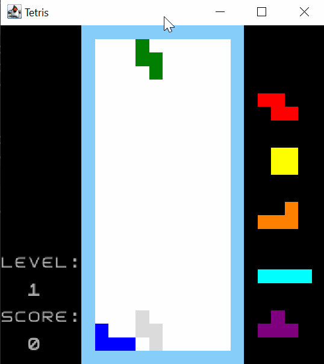
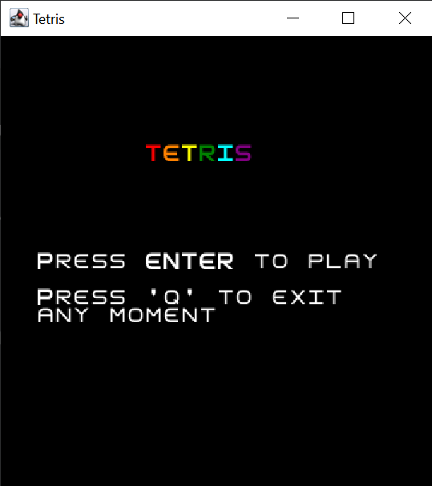
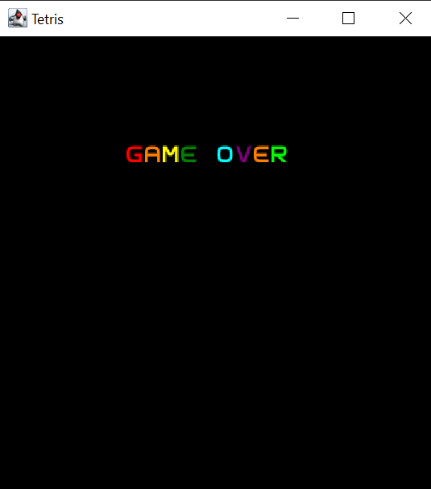

## LDTS_1204 - TETRIS

### GAME DESCRIPTION

Tetris is a tile-matching puzzle game where the player attempt to clear as many lines as possible by completing horizontal rows of blocks without empty space, but if the blocks surpass the skyline the game is over! 

To do this, the game requires players to strategically rotate, move, and drop several blocks of different shapes that fall into the rectangular arena at increasing speeds. 

The completed lines disappear and grant the player points.

There are levels of difficulties which rises as the game is being played.

It ends when the playing field is filled. The longer the player can delay this outcome, the higher the score will be.

This project was developed by Bruna Marques (up202007191@edu.fe.up.pt), Ana Carolina Brandão (up202004461@edu.fc.up.pt) and Miguel Curval (up201105191@edu.fe.up.pt).

### IMPLEMENTED FEATURES

+ **Menu** - When the game starts, the screen shows the starting menu. The player has to press <kbd>Enter</kbd> to star the game and can press <kbd>Q</kbd> anytime to end it.
+ **Player control** - The player may move the pieces with the keyboard control:
  - Move right: <kbd>&rarr;</kbd>
  - Move left: <kbd>&larr;</kbd>
  - Rotate clockwise: <kbd>&uarr;</kbd>
  - Rotate counterclockwise: <kbd>X</kbd>
  - Soft Drop: <kbd>&darr;</kbd>
  - Hard Drop: <kbd>Space</kbd>
  - Hold: <kbd>C</kbd>
+ **Levels** - The game increases difficulty/speed in each level.
+ **Speed** - The speed of the piece changes when it passes the level or when the player presses any of the (hard or soft) drop keys.
+ **Shapes and colors** - Blocks have different shapes and colors.
+ **Next blocks** - Preview of the next five blocks.
+ **Hold** - Ability to put the current block on hold to use it later.
+ **Time** - Time of the game to measure when it passes the level.
+ **Score** - The score the player makes on the screen. Points are made when completing a game line with pieces
+ **GameOver** - When the player loses, it appears a screen with GAMEOVER written.
+ **Ghost piece** - During the game, before the piece falls, a preview (ghost piece) is shown of how the piece will fit depending on how it is positioned when it falls. 
+ **Music** - When the game starts, when the player press <kbd>Enter</kbd>, tetris theme song plays until it's gameover.
+ **Tetris Guidelines** - The game has every single rule from the official Tetris Guidelines implemented.

### SCREENSHOTS OF THE GAME

*Game*

| Menu | Game Over |
|:----------:|:---------:|
| | |

